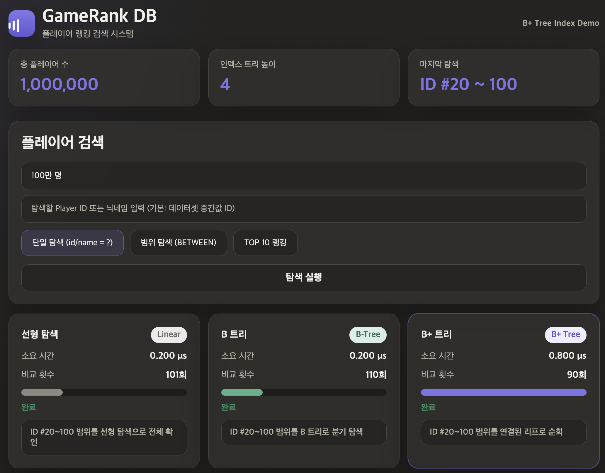
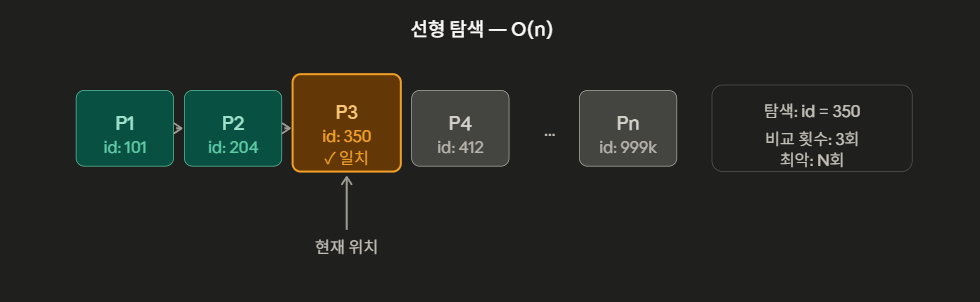
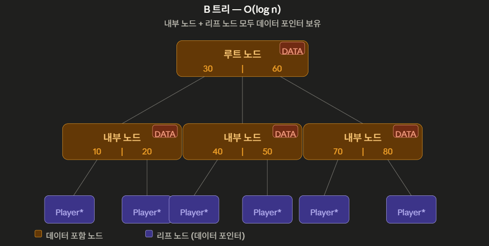

# GameRank DB — B+ 트리 인덱스 구현 프로젝트

> 게임 플레이어 랭킹 DB를 컨셉으로 한 B+ 트리 인덱스 구현 및 성능 벤치마크

---

## 프로젝트 개요

100만 명 이상의 플레이어 데이터를 대상으로 **선형 탐색**, **B 트리**, **B+ 트리** 세 가지 탐색 방식의 성능을 비교한다.



---

## 핵심 개념

### 1. 선형 탐색



- 인덱스 없이 처음부터 끝까지 비교
- 단건 탐색: 평균 N/2 비교
- 범위 탐색: 배열이 정렬되어 있으므로 `id > hi` 시점에 조기 탈출 적용

### 2. B 트리 (ORDER = 32)


- 내부 노드와 리프 노드 **모두** 데이터 포인터 보유
- 이진 탐색으로 각 노드에서 분기 → O(log N)

### 3. B+ 트리 (ORDER = 32)



- **내부 노드는 라우팅만** — 데이터는 리프에만 존재
- 리프가 `next` 포인터로 연결 → 범위 탐색 시 리프만 순회
- 범위 탐색에서 B 트리보다 훨씬 효율적

| 탐색 방식 | 시간 복잡도 | 특징 |
|---|---|---|
| 선형 탐색 | O(n) | 인덱스 없음, 처음부터 순차 탐색 |
| B 트리 | O(log n) | 내부 노드에도 데이터 저장 |
| B+ 트리 | O(log n) | 리프 노드만 데이터 저장, 범위 탐색 최적 |

---

## B+ 트리를 사용하는 이유

선형 탐색은 O(n)으로 대규모 데이터에서 한계가 명확하다. B 트리는 O(log n)으로 개선되지만, 내부 노드에도 데이터가 분산되어 범위 탐색 시 노드를 오가야 한다. B+ 트리는 **리프 노드에만 데이터를 저장하고 리프끼리 연결 리스트로 이어져** 있어, 범위 탐색에 최적화된 구조다.

---

## 폴더 구조

```
gamerank-db/
├── src/
│   ├── common/          # 공통 헤더 (player.h 등)
│   ├── linear/          # 선형 탐색 구현
│   ├── btree/           # B 트리 구현
│   ├── bplus_tree/      # B+ 트리 구현
│   └── benchmark/       # 성능 측정 코드
├── web/                 # 벤치마크 시각화 데모
│   ├── index.html
│   ├── css/styles.css
│   ├── js/app.js
│   ├── assets/          # 결과 데이터 (results.json)
│   └── server/server.pl
├── tests/               # 단위 테스트
├── docs/                # 개념 정리 문서
├── Makefile
└── README.md
```

---

## 빌드 및 실행

```bash
# 전체 빌드
make all

# 데이터 생성 (100만 건)
make datagen

# 벤치마크 실행
make bench

# 결과 출력
make result
```

---

## 벤치마크 방식

- **레코드 수**: 10만 / 50만 / 100만 / 500만
- **탐색 유형**
  - 단일 탐색: `WHERE id = ?`
  - 범위 탐색: `WHERE id BETWEEN ? AND ?`
- **측정 단위**: 마이크로초(μs)
- **측정 함수**: `gettimeofday()`

---

## 쟁점 포인트

**1. 삽입 시 노드 분할 전략**
리프 노드가 가득 찼을 때 분할 기준(중간값)을 어디로 설정하느냐에 따라 트리 균형과 탐색 성능이 달라진다.

**2. 리프 노드 연결 유지**
삽입·삭제 시 리프 간 연결 리스트가 끊기지 않도록 포인터를 일관되게 관리하는 것이 핵심 구현 난제다.

**3. 범위 탐색 최적화**
`WHERE id BETWEEN ? AND ?` 처리 시 첫 번째 키를 트리 탐색으로 찾은 뒤, 이후는 리프 연결 리스트를 따라 순회하는 구조로 성능을 극대화한다.

### B+ 트리가 선형 탐색보다 느린 경우

**1. 배열 앞쪽 탐색**
찾는 값이 배열 앞쪽에 있으면 선형 탐색은 1~2번 비교로 끝난다. 반면 B+ 트리는 루트부터 리프까지 트리 높이만큼 고정 비용이 발생하므로 오히려 느리다.

**2. Cold Start (첫 번째 탐색)**
트리 노드가 메모리에 올라오지 않은 상태에서는 루트 → 내부 노드 → 리프 순으로 내려가면서 매번 캐시 미스가 발생한다. 선형 배열은 메모리가 연속적이라 프리페치가 잘 되어 첫 탐색에서 유리하다. 단, 두 번째 탐색부터는 자주 쓰는 상위 노드가 캐시에 올라오기 때문에 B+ 트리가 압도적으로 빨라진다.

---

## 테스트

| 구분 | 핵심 검증 항목 |
|---|---|
| 삽입 | 노드 분할 후 트리 균형 유지 여부 |
| 탐색 | 단일 / 범위 탐색 결과 정확성 |
| 삭제 | 리프 연결 리스트 무결성 유지 |
| 성능 | 레코드 수 증가에 따른 탐색 시간 변화 |

---

## 팀원

| 담당자 | 영역 | 주요 작업 |
|---|---|---|
| 지현 | `정보 수집` | 구현 방향성 정리, 데이터 수집 |
| 동현 | `기획 · 설계` | 총괄 |
| 명석 | `web/` — 웹 프론트엔드 | UI 고도화, 실측값 반영, 비교 페이지 완성 |
| 승현 | `src/` — C 알고리즘 | B 트리 / B+ 트리 insert · search · range 구현 |

---

## 참고

- [B+ 트리 개념 정리](docs/bplus_tree_개념정리.md)
- [기획 및 설계 문서](docs/planning.md)